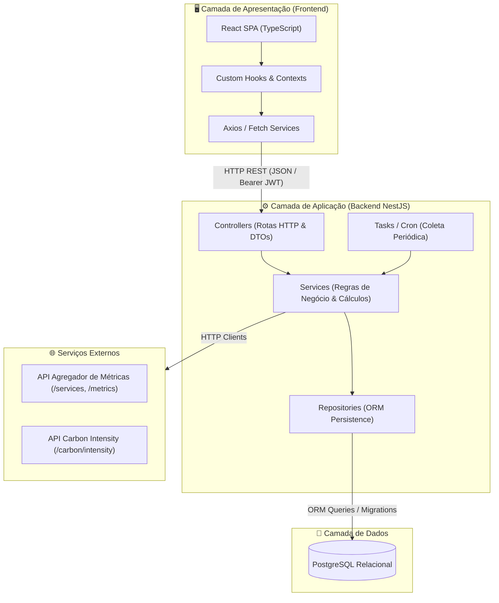

# 🏗️ Arquitetura do Sistema — GreenER

> **Critérios da Rubrica:** DW01, DW03, DW04, DW05, DW07, TP01, TP02  
> **Repositório:** [abpundefined/3DSM-ABP-UNDEFINED](https://github.com/abpundefined/3DSM-ABP-UNDEFINED)  
> **Equipe:** Undefined  

---

## 🧭 1. Visão Geral da Arquitetura

O **GreenER** foi concebido sob uma arquitetura desacoplada e conteinerizada, orientada a microsserviços lógicos e camadas bem definidas, garantindo manutenibilidade, testabilidade e escalabilidade.

A solução é composta por:
1. **Frontend SPA (Single Page Application):** Desenvolvido em **React** com **TypeScript** e build tool **Vite**, focado em visualização de dados, métricas em tempo real e experiência de usuário acessível.
2. **Backend RESTful:** Desenvolvido em **NestJS** com **TypeScript**, estruturado no padrão modular de injeção de dependências, concentrando regras de negócio, agendamento de coletas e cálculos ambientais.
3. **Camada de Persistência:** Banco relacional **PostgreSQL**, operado através de um **ORM** (TypeORM/Prisma) com versionamento de esquema via **migrações automatizadas**.
4. **Ambiente Multi-Container:** Orquestrado via **Docker Compose** (`compose.yaml`), garantindo reprodutibilidade em qualquer ambiente de execução.



---

## 🔙 2. Arquitetura do Backend (NestJS)

O backend segue rigorosamente a estrutura recomendada pelo framework NestJS e pela rubrica de avaliação (**DW03**, **TP01**, **TP02**):

### 📂 2.1 Estrutura de Diretórios
```
backend/
├── migrations/             # Migrações versionadas do banco de dados (DW04)
├── src/
│   ├── main.ts             # Ponto de entrada, configuração de pipes, cors e swagger
│   ├── app.module.ts       # Módulo raiz da aplicação
│   ├── database/           # Configuração do ORM e conexão com PostgreSQL
│   ├── common/             # Interceptors, Exception Filters e decorators globais
│   ├── integrations/       # Clientes HTTP isolados para APIs externas
│   │   ├── metrics/        # Cliente do Agregador de Métricas
│   │   └── carbon/         # Cliente da API de Intensidade de Carbono
│   └── modules/            # Módulos de domínio
│       ├── services/       # Descoberta e metadados dos serviços monitorados
│       ├── coletas/        # Rotina de coleta, persistência e histórico
│       ├── calculos/       # Motor matemático de energia e emissões de CO₂e
│       └── auth/           # Autenticação JWT e guardas de rota (DW06)
```

### 🧱 2.2 Papéis e Responsabilidades das Camadas
- **Controllers:** Responsáveis unicamente por receber a requisição HTTP, validar parâmetros através de DTOs tipados (`class-validator`) e retornar a resposta adequada com o status HTTP correto.
- **DTOs (Data Transfer Objects):** Definem a forma e os tipos dos dados trafegados, garantindo validação estrita na fronteira da API (**TP05**).
- **Services:** Concentram 100% da lógica de negócio. Não interagem diretamente com o protocolo HTTP nem manipulam dados do banco via SQL puro. Isolam as regras de cálculo e as transformações matemáticas.
- **Repositories:** Encapsulam as operações de banco de dados por meio do ORM. Os services consomem os repositórios através de interfaces/injeção de dependência (**TP02**).
- **Integrations / External Clients:** Módulos isolados responsáveis por consumir as APIs externas de métricas e carbono, implementando políticas de timeout, retry e tolerância a falhas (**RF05**, **RNF05**).

---

## 🎨 3. Arquitetura do Frontend (React + TypeScript)

O frontend foi desenhado para manter alta coesão e separação de responsabilidades (**DW05**):

### 📂 3.1 Estrutura de Diretórios
```
frontend/
├── src/
│   ├── assets/             # Imagens, logotipos e ícones
│   ├── components/         # Componentes reutilizáveis
│   │   ├── common/         # Botões, Cards, Loading Spinners, Modais
│   │   ├── layout/         # Header, Sidebar, Footer
│   │   └── charts/         # Gráficos de histórico e dispersão
│   ├── contexts/           # Context API para gerenciamento de estado global
│   ├── hooks/              # Custom Hooks (ex: useMetrics, useAuth, usePolling)
│   ├── pages/              # Páginas da aplicação correspondentes às rotas
│   │   ├── Dashboard/      # Visão geral e métricas consolidadas
│   │   ├── Ranking/        # Tabela e classificação de impacto ambiental
│   │   ├── Comparison/     # Comparação lado a lado entre serviços
│   │   ├── Map/            # Visualização geográfica em mapa
│   │   └── Login/          # Acesso restrito para administradores
│   ├── services/           # Camada de comunicação HTTP (instância Axios centralizada)
│   ├── types/              # Interfaces e declarações de tipos TypeScript compartilhados
│   └── App.tsx             # Roteamento e injeção de providers
```

---

## 🗄️ 4. Modelo de Dados e Persistência (PostgreSQL + ORM)

O banco de dados armazena o cadastro dos serviços monitorados e o histórico cronológico de todas as coletas realizadas, permitindo análises evolutivas e comparações temporais (**RF10**, **DW04**).

### 📊 4.1 Entidades Principais
1. **`Service` (Serviço):**
   - `id`: Identificador único do serviço
   - `name`: Nome do serviço informado pelo agregador
   - `service_type`: Tipo de aplicação/carga
   - `region`: Região / país de hospedagem
   - `latitude` / `longitude`: Coordenadas geográficas
   - `status`: Situação atual (`ACTIVE`, `UNAVAILABLE`, `NO_METRICS`)
   - `created_at` / `updated_at`: Timestamps de controle

2. **`MetricCollection` (Coleta de Métrica):**
   - `id`: Identificador único da coleta
   - `service_id`: Chave estrangeira referenciando `Service`
   - `collected_at`: Data e hora exata da coleta
   - `cpu_usage_mcores`: Uso de processamento em millicores
   - `memory_usage_bytes`: Uso de memória em bytes
   - `requests_per_second`: Volume de requisições por segundo
   - `network_io_bytes`: Volume de tráfego de rede
   - `estimated_energy_kwh`: Consumo energético calculado (kWh)
   - `carbon_intensity_factor`: Fator de emissão aplicado (gCO₂e/kWh)
   - `estimated_carbon_emission_g`: Emissão de carbono calculada (gCO₂e)

---

## 🐳 5. Orquestração em Contêineres (Docker Compose)

O projeto é 100% executável através do `compose.yaml` (**DW07**, **RP05**), composto por 3 serviços conectados em uma rede interna isolada:
- **`postgres`:** Banco de dados relacional com volume persistente mapeado para preservar os dados entre reinicializações.
- **`backend`:** Aplicação NestJS executando na porta 3000, com variáveis de ambiente injetadas e healthcheck de dependência do banco de dados.
- **`frontend`:** Aplicação React servida via servidor estático (Nginx ou Vite preview) na porta 5173.
