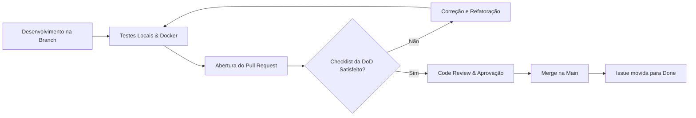

# ✅ Definição de Pronto (Definition of Done — DoD) — GreenER

> **Critério da Rubrica:** GA07 (Gestão Ágil — 3 pontos)  
> **Repositório:** [abpundefined/3DSM-ABP-UNDEFINED](https://github.com/abpundefined/3DSM-ABP-UNDEFINED)  
> **Equipe:** Undefined (3º Semestre DSM — FATEC Jacareí)  

---

## 🎯 1. O que é a Definition of Done (DoD)?

A **Definition of Done (DoD)** é um acordo formal e compartilhado entre todos os membros da equipe de desenvolvimento, o Product Owner (Rainan Reis) e o Scrum Master (Thales Cambraia). Ela estabelece os critérios objetivos mínimos de qualidade e integridade que **toda e qualquer funcionalidade (PBI) ou tarefa técnica deve cumprir** antes de ser considerada "Concluída" (Done) e aceita no fechamento da Sprint.

Um item que não atende a todos os critérios da DoD **não pode** ser movido para a coluna "Done" nem computado como entregue.

---

## 📋 2. Checklist Geral da DoD (Obrigatório para todas as tarefas)

Para que uma Issue / PBI seja dada como **Concluída**, os seguintes critérios devem ser verificados:

### 💻 2.1 Código e Padrões de Qualidade
- [ ] **Funcionalidade Completa:** Todos os critérios de aceitação descritos na Issue/User Story foram implementados e verificados.
- [ ] **TypeScript Estrito:** Nenhum erro de compilação TypeScript (`npm run build`). Não foi utilizado `any` injustificado (atendendo ao critério **TP03**).
- [ ] **Clean Code & SOLID:** Código legível, com nomes significativos de variáveis e métodos, sem funções gigantescas ou código morto comentado (atendendo ao critério **TP01**).
- [ ] **Injeção de Dependências:** Serviços e repositórios desacoplados e injetados via NestJS (atendendo a **TP02**).
- [ ] **Validação e Erros:** DTOs com validação de esquema (`class-validator`) e tratamento de exceções sem quebrar a aplicação (atendendo a **TP05**).

### 🧪 2.2 Testes Automatizados e Manuais
- [ ] **Testes Unitários:** Para regras de negócio centrais (especialmente cálculos ambientais e integrações), testes unitários foram escritos e passam com 100% de sucesso (`npm run test`) (atendendo a **TP04**).
- [ ] **Sem Regressão:** Todas as funcionalidades entregues nas sprints anteriores continuam funcionando normalmente.
- [ ] **Teste Manual no Container:** A funcionalidade foi executada e testada dentro do ambiente Docker Compose oficial.

### 🌐 2.3 Interface e Usabilidade (Para tarefas Frontend)
- [ ] **Design e Protótipo:** A tela ou componente implementado reflete o protótipo aprovado no Figma (atendendo a **IHC02**).
- [ ] **Feedback ao Usuário:** Existem indicadores visuais para estados de carregamento (spinner/skeleton), ausência de dados (empty state) e mensagem amigável de erro (atendendo a **IHC04**).
- [ ] **Acessibilidade de Dados:** Nenhuma informação crítica de status depende exclusivamente de cor; textos ou ícones descritivos acompanham cada indicador (atendendo a **IHC03**).
- [ ] **Responsividade:** A interface foi validada em visualizações desktop e telas reduzidas (mobile/tablet).

### 🔀 2.4 Controle de Versão e GitHub
- [ ] **Branch Padronizada:** O desenvolvimento ocorreu em branch temática derivada da `main` (ex: `feat/coleta-metricas`, `fix/calculo-energia`).
- [ ] **Commits Semânticos:** Mensagens de commit claras e explicativas (ex: `feat: adiciona service de coleta de métricas #3`).
- [ ] **Pull Request (PR) Aprovado:** O PR foi aberto com descrição do que foi feito, vinculando a issue correspondente (ex: `Closes #3`), e foi revisado e aprovado por pelo menos um outro integrante da equipe.
- [ ] **Merge na Branch Principal:** O PR foi integrado via merge na branch `main` sem conflitos.

### 📚 2.5 Documentação
- [ ] **Documentação Atualizada:** Se a entrega introduziu novos endpoints, variáveis de ambiente ou instruções de uso, a documentação em `docs/` e o `README.md` foram devidamente atualizados (atendendo a **GA08** e **DW07**).
- [ ] **Evidências Registradas:** Links do PR e testes foram devidamente apontados na tabela de acompanhamento da sprint.

---

## 🔍 3. Como a DoD é Aplicada no Dia a Dia

1. **Autor da tarefa:** Antes de abrir o Pull Request, passa pelo checklist da DoD.
2. **Revisor (Code Review):** Ao inspecionar o PR, valida se o código cumpre os requisitos de tipagem, testes e padrões definidos na DoD.
3. **Product Owner (Rainan Reis):** Durante o refinamento ou fechamento da Sprint, confere se os critérios de aceitação foram cumpridos na prática.
