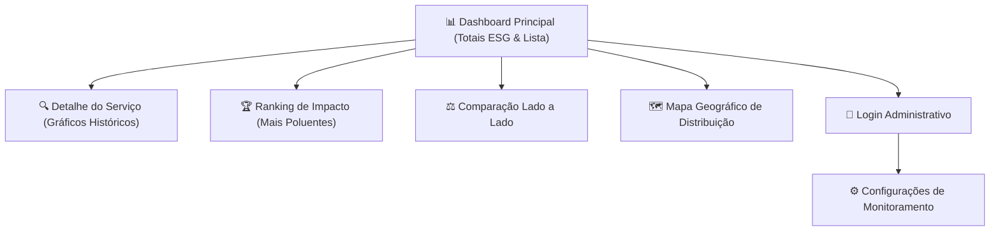

# 🎨 Interface e Usabilidade (IHC) — GreenER

> **Critérios da Rubrica:** IHC01, IHC02, IHC03, IHC04, IHC05, IHC06  
> **Repositório:** [abpundefined/3DSM-ABP-UNDEFINED](https://github.com/abpundefined/3DSM-ABP-UNDEFINED)  
> **Equipe:** Undefined  
> **Link do Protótipo no Figma:** [Acessar Projeto no Figma](https://www.figma.com/design/SEU_LINK_3DSM) *(Substituir pelo link oficial do time)*  

---

## 👥 1. Identificação de Usuários e Tarefas (IHC01)

Para orientar o design da interface e a hierarquia visual das informações, foram definidas duas **Personas** principais representativas dos usuários da plataforma:

### 👤 Persona 1: Beatriz Menezes — Gestora de TI e Sustentabilidade (ESG)
* **Perfil:** 38 anos, diretora de tecnologia responsável pelo cumprimento de metas ESG e descarbonização de TI.
* **Necessidades:**
  - Acompanhar se a organização está dentro do orçamento de emissões de carbono corporativo.
  - Relatórios consolidados de emissão mensal e trimestral em formato claro e exportável.
  - Identificar quais aplicações em nuvem mais oneram a pegada de carbono da empresa.
* **Tarefas Prioritárias na Plataforma:**
  1. Visualizar o total agregado de emissões de $CO_2e$ e consumo em kWh no painel principal.
  2. Consultar o **Ranking de Impacto** para descobrir os 3 serviços mais poluentes do mês.
  3. Comparar dois serviços equivalentes para justificar migração para data centers mais sustentáveis.

---

### 👤 Persona 2: Lucas Ferreira — Engenheiro de Operações e DevOps
* **Perfil:** 27 anos, engenheiro de confiabilidade (SRE) responsável pela disponibilidade e eficiência de microsserviços.
* **Necessidades:**
  - Monitoramento contínuo em tempo real do status das aplicações.
  - Rápida identificação de anomalias (serviços caídos ou que pararam de enviar telemetria).
  - Configuração de intervalos de coleta e limites de tolerância a falhas.
* **Tarefas Prioritárias na Plataforma:**
  1. Acompanhar a lista de serviços ativos, indisponíveis e sem métricas no dashboard operacional.
  2. Inspecionar o gráfico histórico de CPU, memória e energia de um serviço com incidente recente.
  3. Acessar a área autenticada para reconfigurar a periodicidade das coletas.

---

## 📱 2. Protótipos e Fluxos de Navegação (IHC02)

O fluxo da aplicação foi estruturado de forma intuitiva, permitindo que as decisões críticas sejam tomadas com no máximo dois cliques a partir do dashboard principal:

### 🖼️ Telas Planejadas e Prototipadas no Figma:
1. **Dashboard Geral:** Exibição dos cards de totais (Energia em kWh e Carbono em kgCO₂e), barra de busca de serviços e tabela com status em tempo real.
2. **Visualização em Mapa:** Mapa-múndi interativo com pontos georreferenciados coloridos e com ícones informativos.
3. **Módulo de Comparação:** Seleção múltipla de serviços com gráficos sobrepostos de intensidade de carbono.
4. **Painel de Configuração:** Formulário limpo e restrito via autenticação JWT para ajuste de rotinas.

---

## 🏷️ 3. Clareza de Indicadores, Unidades e Acessibilidade (IHC03)

O GreenER foi projetado sob fortes diretrizes de acessibilidade e transparência de dados (**RNF02**):

- **Unidades Explícitas:** Nenhum número é exibido sem unidade de medida formal associada (ex: `14.85 kWh`, `354.2 gCO₂e`, `1.25 PUE`).
- **Data e Hora de Atualização:** A interface exibe no topo o timestamp preciso da última coleta realizada (`Última sincronização: 01/10/2026 às 15:42:10`).
- **Acessibilidade de Estados (Não depende apenas de cor):**
  - 🟢 **Ativo:** Acompanhado pelo ícone de check `✓` e texto explicativo `"Operacional"`.
  - 🔴 **Indisponível:** Acompanhado pelo ícone de alerta `⚠` e texto explícito `"Falha de Conexão"`.
  - 🟡 **Sem Métricas:** Acompanhado pelo ícone de interrogação `?` e texto `"Sem Telemetria"`.
- **Modo Alto Contraste:** Relação de contraste entre texto e fundo superior a `4.5:1` conforme diretrizes WCAG 2.1 AA.

---

## ⚡ 4. Responsividade e Estados de Feedback (IHC04)

- **Feedback de Carregamento:** Utilização de componentes de *Skeleton Loading* durante as requisições à API, evitando quebras visuais de layout.
- **Empty States:** Telas sem dados (ex: busca sem resultados ou ausência de coletas no período) apresentam ilustrações dedicadas e instruções claras de como proceder.
- **Tratamento Amigável de Erros:** Quando uma API externa falha, a interface exibe um banner informativo explicativo (ex: *"A API de Carbon Intensity está temporariamente indisponível; exibindo estimativa com base na média regional brasileira"*), sem interromper a navegação.
- **Mobile First e Flexbox:** O layout adapta-se fluidamente de monitores ultrawide (1440px+) até smartphones compactos (360px).

---

## 🧪 5. Plano de Avaliação de Usabilidade (IHC05 — Previsto para Sprint 3)

A avaliação de usabilidade será conduzida no início da Sprint 3 com **5 usuários reais** (estudantes e profissionais de TI):

### 📋 Roteiro de Teste Proposto:
1. **Tarefa 1:** Localizar o serviço que consumiu a maior quantidade de energia nas últimas 24 horas.
2. **Tarefa 2:** Selecionar dois serviços e realizar uma comparação direta de emissão de CO₂e.
3. **Tarefa 3:** Identificar se existe algum serviço fora do ar no momento e qual sua região de hospedagem.
4. **Métricas Coletadas:**
   - Taxa de sucesso na conclusão da tarefa sem assistência.
   - Tempo médio por tarefa (Time on Task).
   - Questionário SUS (System Usability Scale) ao final do teste.

---

## 🚀 6. Melhorias Decorrentes da Avaliação (IHC06 — Previsto para Sprint 3)

Após a realização dos testes com usuários, todos os apontamentos de fricção, dúvidas de usabilidade ou dificuldades visuais serão convertidos em issues do GitHub e implementados no código antes da tag final `sprint-3`.
